                                                     
In the current world, technology has been facing sudden changes and has been improving in all aspects.

The world is in a race to actually achieve more reliability and also speed in their work. The Internet can be considered as one of the important backbones of most of the Technological advancements running currently.

The Amazon Web Services(AWS) which is one of the popular Cloud Computing Company has been working on a concept to bring the Kubernetes into the Cloud Computing World and it is just an amazing service with many amazing features that help us with customizations.

<h1>Let's Start </h1>

There are some pre requisite  we need to have like :

1. eksctl needs to be downloaded and added to the Environment path
2. kubectl configured up and running to use the kubernetes
3. Provide Role to the EKS by the accont that can be access via IAM service.

If these all are met , then we can start easily...

<h3>Step-1</h3>
We need to create a YAML file that will help us to create a cluster with the typw f instance we need and also the number of Instance we need...

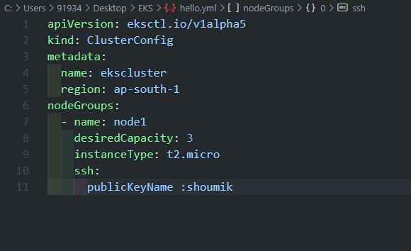

          apiVersion: eksctl.io/v1alpha5
        kind: ClusterConfig
        metadata:
          name: ekscluster
          region: ap-south-1
        nodeGroups:
          - name: node1
            desiredCapacity: 3
            instanceType: t2.micro
            ssh:
              publicKeyName :shoumik

I have used a Key Group that was created before so that we can use it login to the instances using this key.

I also have created a profile so that I can configure aws accounts and still use it via CLI.For  this case I used the EKS profile...

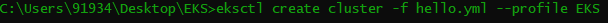

This will launch the Cluster. It will takes sometime to launch the cluster.It took 40 Minutes in my case...

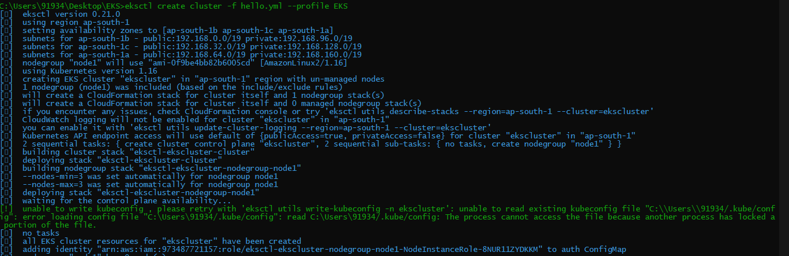

Then once it is done, we can use the WebUI to check if everything is done or not...

In my case it was successful,

<b>Cluster Created</b>

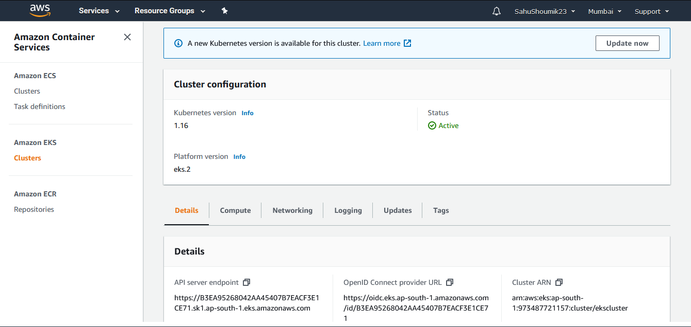

<b>Instance Launched</b>

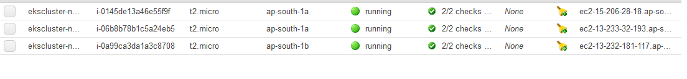

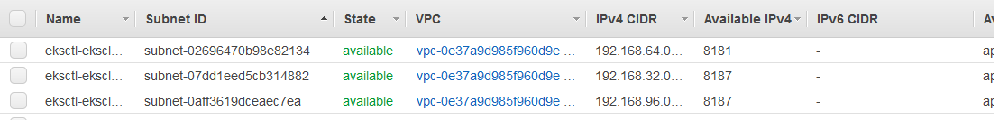

<h3>Step-2</h3>

Cluster is created and also all the other requies stuffs like ENI, Volume and all other are creeated.

It still needs a File System that will give us a NFS fiile system to use with the AWS Cloud Services

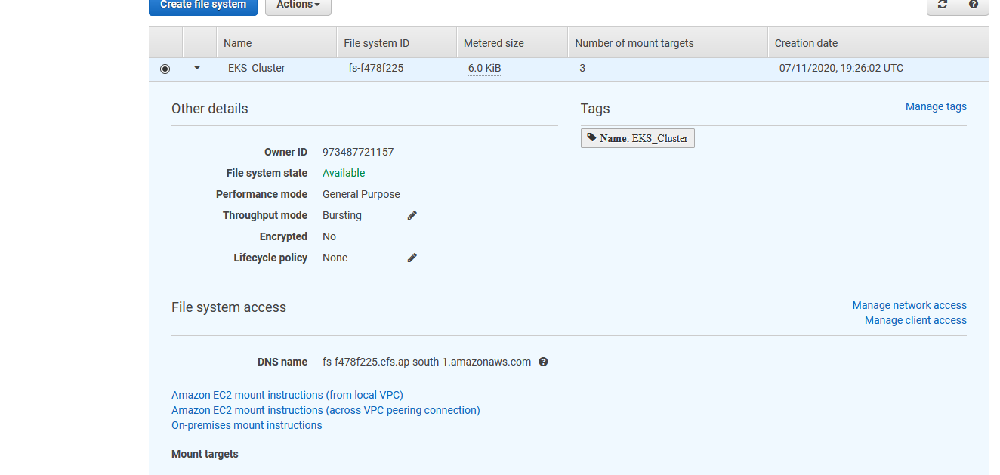

After it is done we need to create a provisioner that will allow us to mount the EFS created to the PersistentVolume...
 We create the provisioner via YAML file...
 
 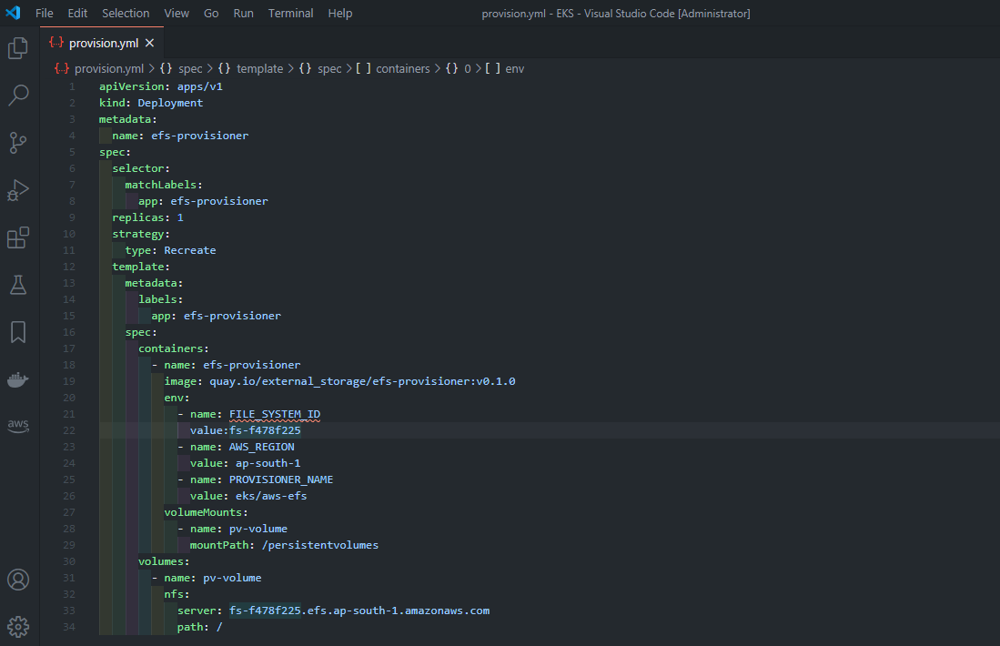
 
 Make sure to input the value of FILE_SYSTEM_ID and server as per the links that is provided by the EFS that we created.
 
 This will be created by the Kubectl...
 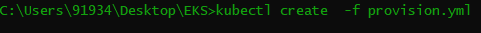
 
     apiVersion: apps/v1
    kind: Deployment
    metadata:
      name: efs-provisioner
    spec:
      selector:
        matchLabels:
          app: efs-provisioner
      replicas: 1
      strategy:
        type: Recreate
      template:
        metadata:
          labels:
            app: efs-provisioner
        spec:
          containers:
            - name: efs-provisioner
              image: quay.io/external_storage/efs-provisioner:v0.1.0
              env:
                - name: FILE_SYSTEM_ID
                  value:fs-f478f225
                - name: AWS_REGION
                  value: ap-south-1
                - name: PROVISIONER_NAME
                  value: eks/aws-efs
              volumeMounts:
                - name: pv-volume
                  mountPath: /persistentvolumes
          volumes:
            - name: pv-volume 
              nfs:
                server: fs-f478f225.efs.ap-south-1.amazonaws.com
                path: /

 <h3>Step-3</h3>
 
 Now we need to modify the access so that the role of the instances will help us to access it...
 
 We use the <b>Role-Based Access Control(RBAC)</b> to modify the roles and we did it using  the YAML file again...
 
 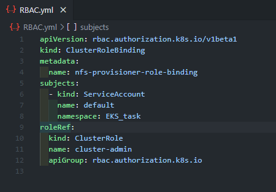
 
         apiVersion: rbac.authorization.k8s.io/v1beta1
        kind: ClusterRoleBinding
        metadata:
          name: nfs-provisioner-role-binding
        subjects:
          - kind: ServiceAccount
            name: default
            namespace: EKS_task
        roleRef:
          kind: ClusterRole
          name: cluster-admin
          apiGroup: rbac.authorization.k8s.io

 
 Then we just run the file ...
 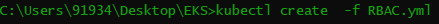
 
 
 <h3>Step-4</h3>
 
 Next is to create a Persistent Volume Claim(PVC) that can act as a storage adn act as a permanent storage...
 
 We again create a YAML file for that, 
 
 In it we have created three PV..
 1. For the the EFS.
 2. For the Jenkins.
 3. For the MySQL.
 
 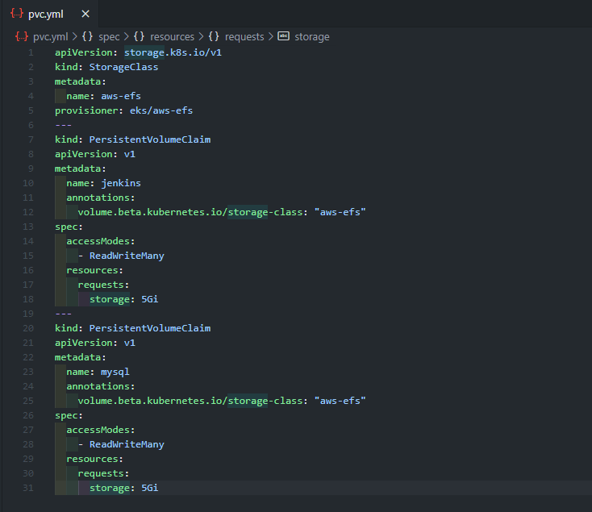
 
     apiVersion: storage.k8s.io/v1
    kind: StorageClass
    metadata:
      name: aws-efs
    provisioner: eks/aws-efs
    ---
    kind: PersistentVolumeClaim
    apiVersion: v1
    metadata:
      name: jenkins
      annotations:
        volume.beta.kubernetes.io/storage-class: "aws-efs"
    spec:
      accessModes:
        - ReadWriteMany
      resources:
        requests:
          storage: 5Gi
    ---
    kind: PersistentVolumeClaim
    apiVersion: v1
    metadata:
      name: mysql
      annotations:
        volume.beta.kubernetes.io/storage-class: "aws-efs"
    spec:
      accessModes:
        - ReadWriteMany
      resources:
        requests:
          storage: 5Gi

Then its as usual to run it to get the PVC...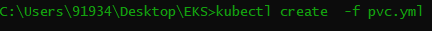

<h3>Step-4</h3>

Now we will create Secret for both the Jenkins and MySQL...

<h2>Jenkins</h2>

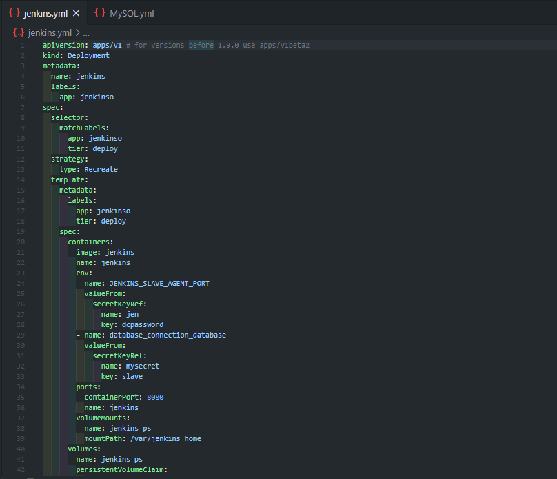

     apiVersion: apps/v1 # for versions before 1.9.0 use apps/v1beta2
    kind: Deployment
    metadata:
      name: jenkins
      labels:
        app: jenkinso
    spec:
      selector:
        matchLabels:
          app: jenkinso
          tier: deploy
      strategy:
        type: Recreate
      template:
        metadata:
          labels:
            app: jenkinso
            tier: deploy
        spec:
          containers:
          - image: jenkins
            name: jenkins
            env:
            - name: JENKINS_SLAVE_AGENT_PORT
              valueFrom:
                secretKeyRef:
                  name: jen
                  key: dcpassword
            - name: database_connection_database
              valueFrom:
                secretKeyRef:
                  name: mysecret
                  key: slave
            ports:
            - containerPort: 8080
              name: jenkins
            volumeMounts:
            - name: jenkins-ps
              mountPath: /var/jenkins_home
          volumes:
          - name: jenkins-ps
            persistentVolumeClaim:
              claimName: jenkins

   Next is ...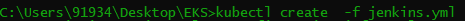
<h2>MySQL</h2>
 
 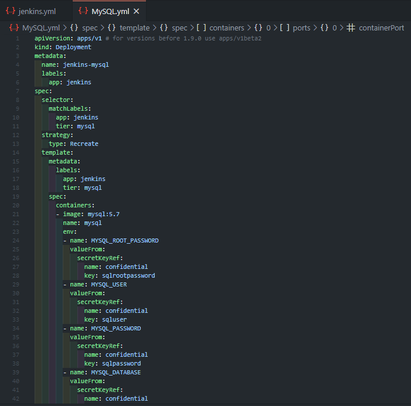

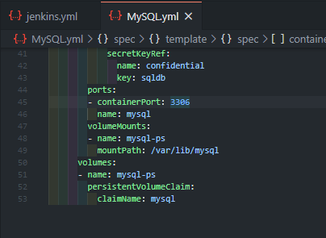

    apiVersion: apps/v1 # for versions before 1.9.0 use apps/v1beta2
    kind: Deployment
    metadata:
      name: jenkins-mysql
      labels:
        app: jenkins
    spec:
      selector:
        matchLabels:
          app: jenkins
          tier: mysql
      strategy:
        type: Recreate
      template:
        metadata:
          labels:
            app: jenkins
            tier: mysql
        spec:
          containers:
          - image: mysql:5.7
            name: mysql
            env:
            - name: MYSQL_ROOT_PASSWORD
              valueFrom:
                secretKeyRef:
                  name: confidential
                  key: sqlrootpassword
            - name: MYSQL_USER
              valueFrom:
                secretKeyRef:
                  name: confidential
                  key: sqluser
            - name: MYSQL_PASSWORD
              valueFrom:
                secretKeyRef:
                  name: confidential
                  key: sqlpassword
            - name: MYSQL_DATABASE
              valueFrom:
                secretKeyRef:
                  name: confidential
                  key: sqldb
            ports:
            - containerPort: 3306
              name: mysql
            volumeMounts:
            - name: mysql-ps
              mountPath: /var/lib/mysql
          volumes:
          - name: mysql-ps
            persistentVolumeClaim:
              claimName: mysql

This is the last one...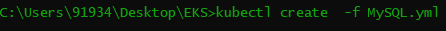

With this all our setup is complete and now we can easily use the Jenkins that we can use via the pods...

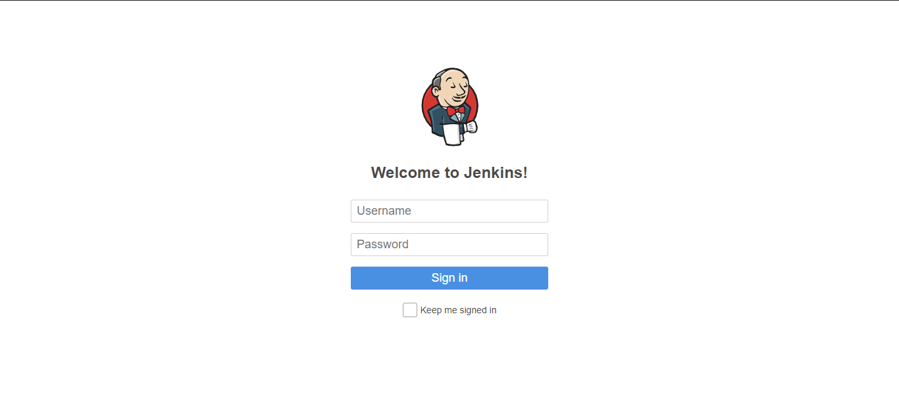

As EKS is not a free service so I was charged and with my error debug and all it costed me...

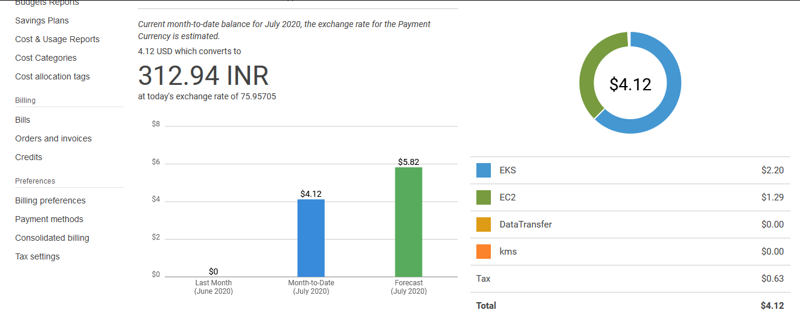

Thanks for your patience and if you have any doubt then feel free to contact...

WhatsApp:9338455463(No class plzzz).

<h1>Thank You</h1>

